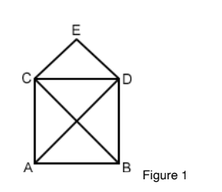
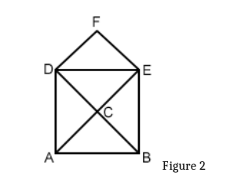
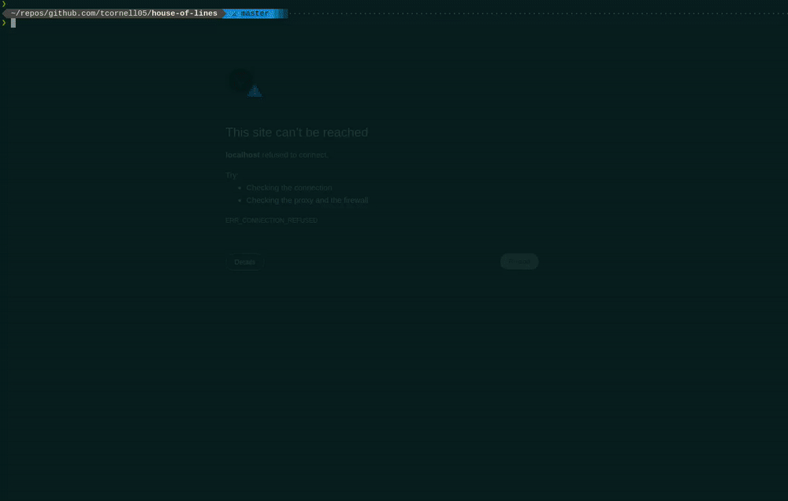

# House of Lines

You are supposed to draw a house on paper without lifting your pencil or drawing any of the lines twice. If you label the corners A through E as in figure 1, one possible solution would be: A -> B -> D -> C -> E -> D -> A -> C -> B. How many possible solutions are there?

## Figures

**Figure 1**


You can make it more challenging by letting the player change the pencil's direction at the point where the diagonals intersect. In that case, we would label the corners as in figure 2 and a possible solution would be: A -> C -> B -> A -> D -> C -> E -> D -> F -> E -> B. Now how many solutions are there?

**Figure 2**


## Task
Write a Node.js program consisting of one or more files that finds and lists all possible ways of drawing the figure using the above notation. Once done, enhance the program to ignore solutions that are reflections of solutions already in the result set.
Make this program accessible on a web page that lets the user select from the two different options. The output page should contain the solutions set along with some information about the complexity of the algorithm and time it took to calculate the result.


# My solution:
This is graph theory problem. The main objective is finding Eulerian paths/trails in a finite graph.

- I utilized Vue.js for a front-end implementation/visual guide of the algorithm.
- To find the eulerian paths I wrote the DFS solution in Node.js (ES6). You can find the guts of it at lib/graphHelper.js
- The algorithm itself determines the starting vertices (which is determines there would be two, A & B, since they have the odd degree), however, when displaying the result set I only output from one vertex (A) since reflections are not wanted
- The front-end interfaces with the graphHelper module at src/App.vue.
- The output will state a complexity of ~O(m+n) for both graphs since it utilizes the same algo. 

#### ENJOY!

## Project setup
```
npm install
```

### Compiles and hot-reloads for development
```
npm run serve
```
## Demo



